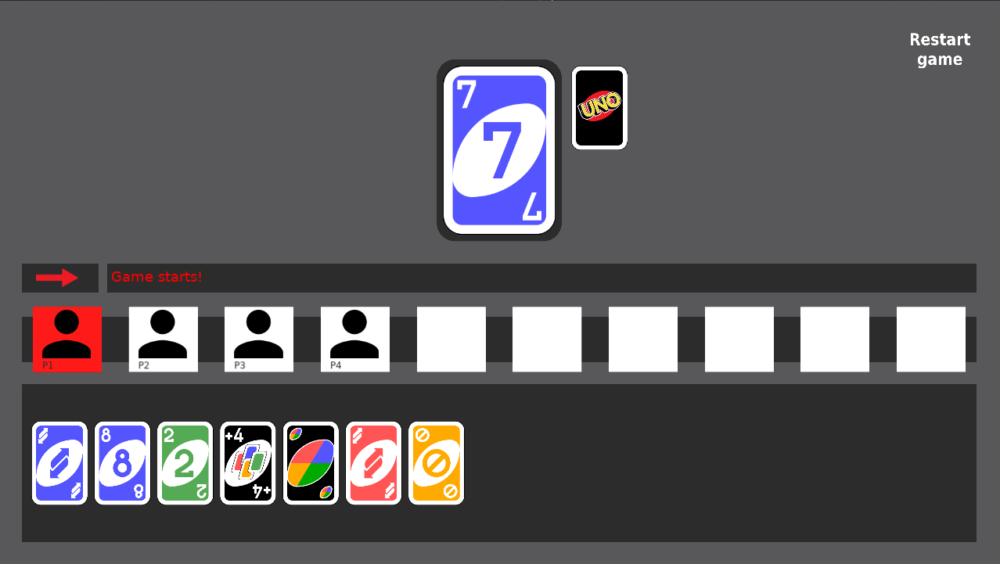
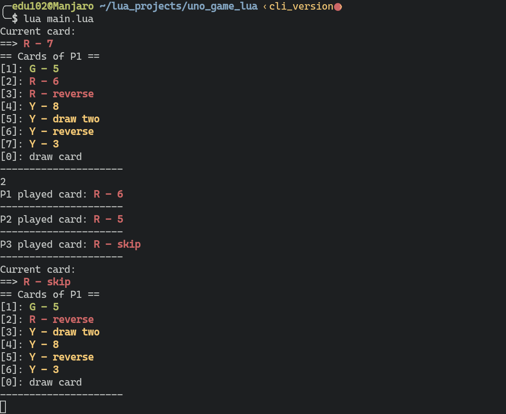

# UNO card game in lua

Uno game implementation in lua using just terminal I/O and love2d.  




Following the [oficial rules](https://en.wikipedia.org/wiki/Uno_(card_game)).
Card images from https://en.wikipedia.org/wiki/Uno_(card_game)#/media/File:UNO_cards_deck.svg

## Quick Guide

1. go to `main.lua` and ad or delete players, change human to false if you want the player to be
AI controlled.
```lua
local players = {
  Player.new({name = "Kevin", human = true }), -- is controllable
  Player.new({name = "John",  human = false}), -- will play by itself
  Player.new({name = "Pablo", human = false}), -- will play by itself
}
```
2. You can add 2 - 10 players.
3. run CLI version or GUI version.

### CLI version

checkout branch `cli_version` and run `lua main.lua`.

### GUI version

gui version is in master branch and uses [love2d](https://love2d.org/) library.
Install love2d and then run `love .`.


## Differences with real game

* Can't say UNO when a player has one card left(I mean, you can but it has no
effects on the game).
* Action cards can't appear as first card.

## TODOs

- [ ] Use corutines for AI waiting in gui mode
- [ ] improve UX I guess ?
